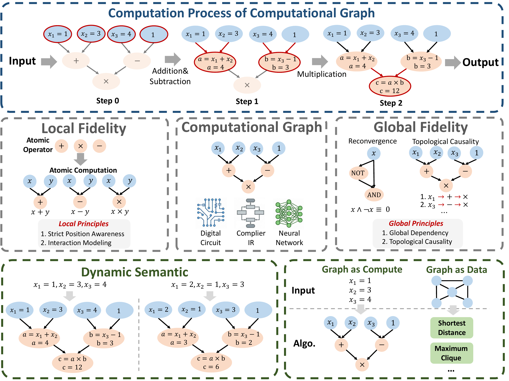
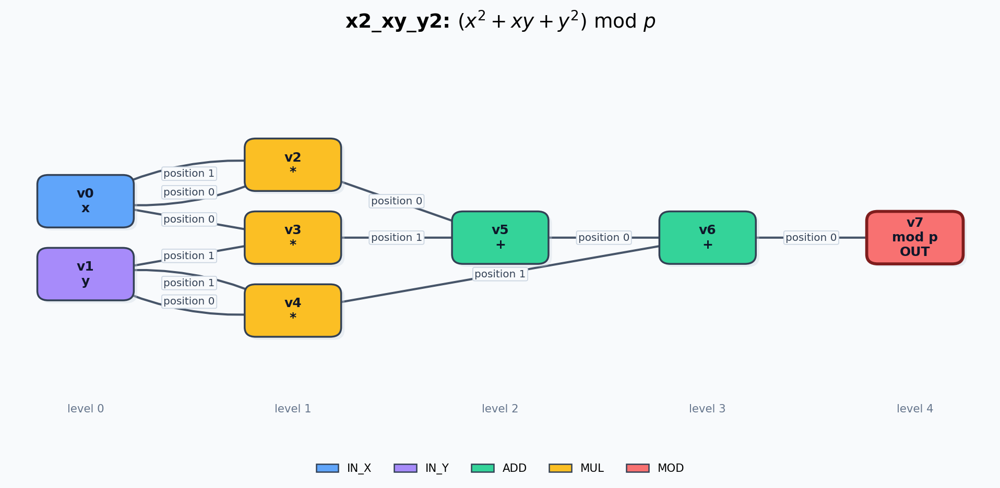
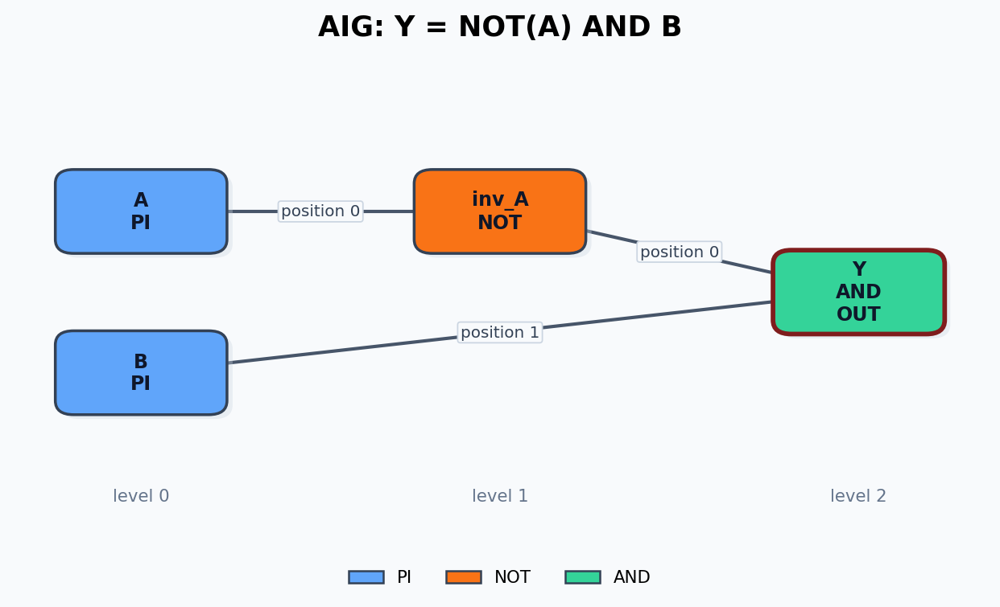
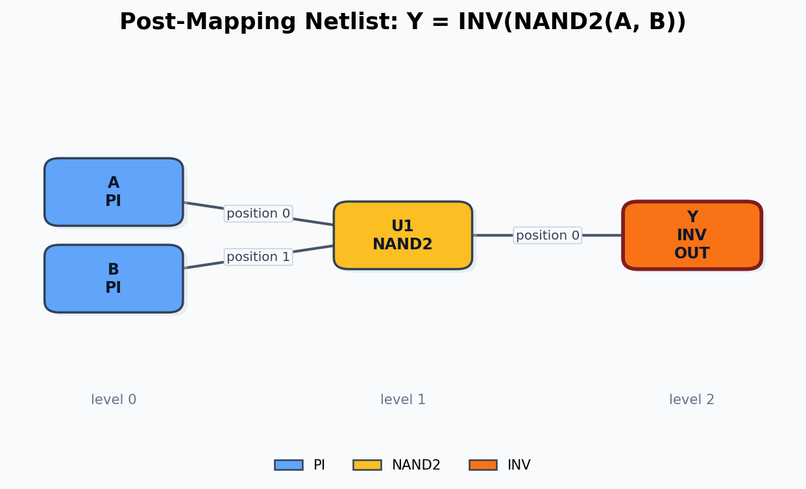

<script>
  window.MathJax = {
    tex: {
      inlineMath: [['$', '$'], ['\\(', '\\)']],
      displayMath: [['$$', '$$'], ['\\[', '\\]']]
    },
    svg: {
      fontCache: 'global'
    }
  };
</script>
<script async src="https://cdn.jsdelivr.net/npm/mathjax@3/es5/tex-svg.js"></script>

More details can be found in the [TRACE computational graph tutorial repository](https://github.com/zyzheng17/TRACE_DAC26/tree/main/computational_graph).

This tutorial is a small, self-contained setting for understanding TRACE's core idea on computational graphs.

## What Is A Computational Graph?

**Definition**(Computational Graph) A computational graph is defined as $\mathcal{G} = (V, E)$, where:
- $V = \{v_1, \dots, v_n\}$ is a set of vertices representing operands (variable or constant) or atomic computational operations.
- $E \subseteq V \times V$ is a set of directed edges representing the flow of information. An edge $e_{ij} = (v_i, v_j)$ implies that the output of operation $v_i$ is a necessary operand for $v_j$.

The overview figures are included below.




In this tutorial, a graph represent $z = x^2 + x*y + y^2 \mod p$ with graph:




Each sample keeps the same graph topology but assigns different values to input nodes `x` and `y`. This tutorial runs one forward pass through TRACE to show how the graph is represented and how information flows through the model.

## Circuits into Unified Computational Graph

Although circuit datasets come from different abstraction levels, we convert each of them into the same computational-graph format: nodes represent typed operands or operations, and directed edges represent ordered data dependencies.

### And-Inverter Graph (AIG)

AIG already has a graph-like structure. We map primary inputs, AND gates, NOT/inverter operations, and optional sequential registers to node types. Edges preserve signal flow and input order. For example, `Y = NOT(A) AND B` becomes a small computational graph with two PI nodes, one inverter node, and one AND output node.



### Post-Mapping Netlist

For a post-mapping netlist, we treat each standard-cell instance as an operation node and each net as a directed dependency between cell inputs and outputs. This keeps technology-mapped information, such as NAND2 and INV, instead of reducing everything to abstract Boolean operators. For example, `Y = INV(NAND2(A, B))` is represented by PI nodes feeding a NAND2 cell node, followed by an INV output node.



### Register Transfer Level (RTL)

For RTL, we follow the AST-based extraction strategy used in prior work [1]. The data-preparation code first extracts a cone rooted at each register endpoint, parses it with PyVerilog, and builds an AST dependency graph. A small RTL fragment can be written as:

```verilog
reg  [1:0] R0, R1;
reg  [2:0] R2;
wire [2:0] W1;

assign W1 = R0 + R1;

always @(posedge clk) begin
  R2 <= W1;
end
```

The visualization below uses the forward data-flow view for readability: `R0` and `R1` feed an `ADD` operator, and the result is written into register `R2`. The temporary wire `W1` is omitted from the figure because it only forwards the operator result.

In the actual parser used by `tasks/contrastive/rtl/data_prep`, each graph is extracted as a cone rooted at a register endpoint. Temporary wires such as `W1` may be eliminated during graph construction, but the same computation dependency is preserved.


[1] Fang W, Liu S, Wang J, et al. Circuitfusion: multimodal circuit representation learning for agile chip design[J]. arXiv preprint arXiv:2505.02168, 2025.

## Core Idea: What Makes a Good Computational Graph Model?

A good computational graph model should be designed around the nature of computation itself. Since computational graphs represent functional transformations rather than ordinary relations, the model should capture both **local operator behavior** and **global causal structure**.

### 1. Local View: Precision in Atomic Computation

At the local level, each vertex represents an atomic computation, such as an arithmetic operator or a logic gate. To model such computations faithfully, two properties are essential.

#### Position Awareness

Many computational operations are sensitive to input order. For example, in `Sub(x, y)`, the first and second operands have different semantic roles. Swapping them changes the operation from `x - y` to `y - x`.

Therefore, a computational graph model must distinguish input positions or ports. It should know which operand enters which position, rather than treating all inputs as interchangeable.

#### Interaction Modeling

An operator is usually defined by the joint relationship among its inputs. For example, in `x * y`, the contribution of `x` depends on the value of `y`, and vice versa.

Thus, the model must capture interactions among operands, not merely process each input separately. This is necessary for representing the functional behavior of arithmetic, logical, and other computational operators.

### 2. Global View: Causality and Dependency

At the global level, a computational graph encodes the flow of computation across the entire program. A good model must therefore respect dependency, causality, and execution order.

#### Global Dependency and Reconvergence

A key challenge is path reconvergence, where one variable branches into multiple paths and later merges again. The merged signals may look separate locally, but they remain correlated because they share the same origin.

For example, in `z = x AND NOT x`, even if `x` and `NOT x` appear as two inputs to the final operator, they are strictly dependent. The correct result is always `z = 0`.

This means the model must capture long-range dependencies and shared ancestry in the graph. Without this ability, it may misinterpret correlated signals as independent.

#### Topological Causality

Computation follows a causal order: a node can only be evaluated after all of its inputs are available. Therefore, the model should respect the topological order of the directed acyclic graph.

Each node representation should be derived from the resolved states of its ancestors. This ensures that the model mirrors the actual execution process and avoids reasoning from unavailable or causally invalid information.


## TRACE Idea In This Tutorial

The minimal TRACE encoder in [model.py](https://github.com/zyzheng17/TRACE_DAC26/blob/main/computational_graph/model.py) follows the computation order:

1. Initialize each node by operation type and input value.
2. Visit nodes level by level in topological order.
3. For each operator node, collect its ordered input operands with positional embeddings.
4. Apply a small Transformer over `[operator token, input 0, input 1, ...]`.
5. Read out the designated output node.

This mirrors the TRACE idea used in the main circuit tasks: preserve computational order, preserve operand positions, and model local operator interactions with an expressive set encoder.

## Expressions

Available expressions:

- `add`: `(x + y) mod p`
- `sub`: `(x - y) mod p`
- `xy`: `(x * y) mod p`
- `x2_y2`: `(x^2 + y^2) mod p`
- `x2_xy_y2`: `(x^2 + x*y + y^2) mod p`
- `x2_xy_y2_x`: `(x^2 + x*y + y^2 + x) mod p`
- `x3_xy`: `(x^3 + x*y) mod p`
- `x3_xy2_y`: `(x^3 + x*y^2 + y) mod p`

The `x^2` and `x^3` terms are expanded into multiplication nodes, not separate power operators. See [expr_graphs.py](https://github.com/zyzheng17/TRACE_DAC26/blob/main/computational_graph/expr_graphs.py) for the graph templates and [dag_visualizations/README.md](https://github.com/zyzheng17/TRACE_DAC26/blob/main/computational_graph/dag_visualizations/README.md) for rendered examples.

## Run The Demo

Run the default demo:

```bash
cd TRACE/tasks/tutorial/computational_graph
python demo.py
```


The demo prints:

- The computational graph nodes, edge positions, and topological levels.
- The TRACE encoder components and embedding sizes.
- The input tensor shapes passed to the model.
- The forward flow, level by level, including which source nodes feed each operator node.
- The untrained model output and the ground-truth arithmetic value.

This is intentionally not a training script. The model uses random weights, so the scalar prediction is only used to illustrate the input/output interface.

For example, with:
```bash
python demo.py --expr x2_xy_y2 --x 3 --y 5
```


The [demo.py](https://github.com/zyzheng17/TRACE_DAC26/blob/main/computational_graph/demo.py) script will print the graph structure and forward flow:


```
== Computational Graph ==
expr: x2_xy_y2
num_nodes: 8
output_node_idx: 7

Nodes:
  v0: type=IN_X  input_value=3   level=0
  v1: type=IN_Y  input_value=5   level=0
  v2: type=MUL   input_value=0   level=1
  v3: type=MUL   input_value=0   level=1
  v4: type=MUL   input_value=0   level=1
  v5: type=ADD   input_value=0   level=2
  v6: type=ADD   input_value=0   level=3
  v7: type=MOD   input_value=0   level=4

Edges:
  e0: v0 -> v2 position=0
  e1: v0 -> v2 position=1
  e2: v0 -> v3 position=0
  e3: v1 -> v3 position=1
  e4: v1 -> v4 position=0
  e5: v1 -> v4 position=1
  e6: v2 -> v5 position=0
  e7: v3 -> v5 position=1
  e8: v5 -> v6 position=0
  e9: v4 -> v6 position=1
  e10: v6 -> v7 position=0


== Forward Flow ==
Level 1: Transformer input shape (3, 5, 64)
  target v2 receives [v0, v0] at positions [0, 1], prefix sequence [v2, v0, v0], computation: v2=x*x
  target v3 receives [v0, v1] at positions [0, 1], prefix sequence [v3, v0, v1], computation: v3=x*y
  target v4 receives [v1, v1] at positions [0, 1], prefix sequence [v4, v1, v1], computation: v4=y*y
Level 2: Transformer input shape (1, 5, 64)
  target v5 receives [v2, v3] at positions [0, 1], prefix sequence [v5, v2, v3], computation: v5=x*x + x*y
Level 3: Transformer input shape (1, 5, 64)
  target v6 receives [v5, v4] at positions [0, 1], prefix sequence [v6, v5, v4], computation: v6=x*x + x*y + y*y
Level 4: Transformer input shape (1, 5, 64)
  target v7 receives [v6] at positions [0], prefix sequence [v7, v6], computation: v7=x*x + x*y + y*y mod p
```
The forward flow shows the details of idea of TRACE:
At level 1, the input batched prefix sequences are:
```
[[v2, v0, v0],
[v3, v0, v1],
[v4, v1, v1]]
```
which represent:
```
[[*, x, x],
[*, x, y],
[*, y, y]]
```
then we compute and assign:
```
v2=x*x,
v3=x*y,
v4=y*y
```
We recursivly repeat above flow in level 2,3,4 until we traverse all the node.


## Files

- [expr_graphs.py](https://github.com/zyzheng17/TRACE_DAC26/blob/main/computational_graph/expr_graphs.py): expression templates and computational graph construction.
- [data.py](https://github.com/zyzheng17/TRACE_DAC26/blob/main/computational_graph/data.py): modular arithmetic ground-truth functions.
- [model.py](https://github.com/zyzheng17/TRACE_DAC26/blob/main/computational_graph/model.py): minimal TRACE-style encoder.
- [demo.py](https://github.com/zyzheng17/TRACE_DAC26/blob/main/computational_graph/demo.py): one-pass tutorial that prints graph construction, model architecture, forward flow, and input/output tensors.
- `assets/`: figures copied from the computational-graph paper draft.
- `circuit_visualizations/`: example DAG visualizations for AIG, post-mapping netlist, and RTL conversion.
- `dag_visualizations/`: arithmetic-expression DAG visualizations used in this tutorial.
