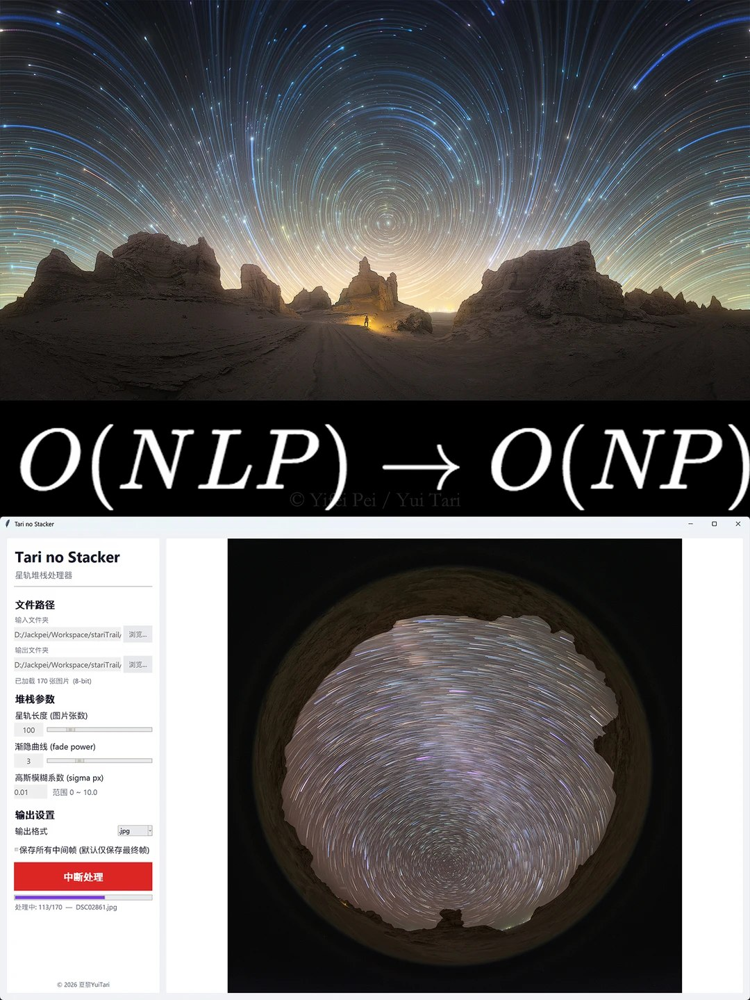
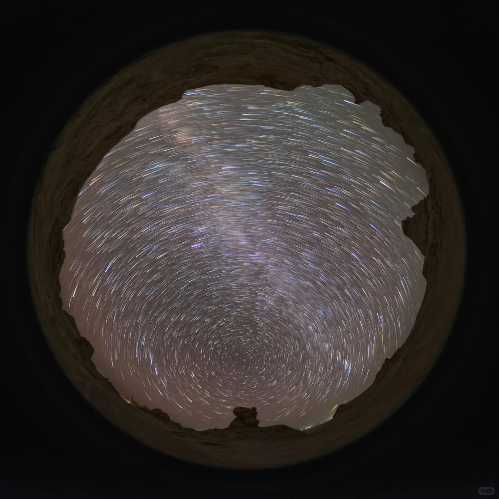

这里是 @夏黎YuiTari ，想通过「星野开源」和大家交流星野摄影中的一些方法。

这次想分享一个我自己琢磨的渐隐星轨堆栈方法。


起因很简单：我想用 TIFF 做星轨堆栈，但 Photoshop 处理 TIFF 堆栈时会生成很大的中间文件，直接把电脑空间挤爆。后来试过用达芬奇做渐隐星轨视频，但大量高分辨率素材下速度也比较慢，而且导出时也容易卡死。

一般的，普通星轨堆栈常用“取最大值”，也就是每个像素保留所有照片里最亮的值。这样能叠出星轨，但轨迹往往比较硬，不够自然。如果要做“头部亮、尾部暗”的渐隐效果，传统方法通常会用滑动窗口：每次输出一张结果，都回看最近 L 张图，给不同时间的图乘上不同权重，再取最大值。

这个方法直观，但计算量比较大。假设总共有 N 张图，每张图有 P 个像素，窗口长度是 L，那么传统窗口法的复杂度大约是：

```text
O(N × L × P)
```

也就是说，如果星轨长度设成 100 张，每次输出一张图，都要处理近 100 张图的像素量。

我的想法是，不保存整个窗口，只保存两样东西来迭代：

1. 当前累计出来的星轨图
2. 一张“年龄图”

“年龄图”记录的是：每个像素位置的星轨残影已经持续了多少帧。



如果当前照片某个位置出现了更亮的新星点，这个位置的年龄就清零，说明这里是新的星轨头部；如果没有新图超过旧残影，年龄就加一，说明它正在变成更老的尾巴。

然后算法根据每个像素的年龄，去查一张提前算好的衰减表。比如设定星轨维持 100 张图，就提前算好第 0 帧、第 1 帧……第 100 帧分别应该保留多少亮度。运行时只需要查表，不需要反复计算复杂公式。

这样整体计算量就接近：

```text
O(N × P)
```

也就是和普通最大值堆栈同一个量级，只是多了一些查表、衰减和年龄更新的开销。相比传统滑动窗口法，它不会随着星轨长度 L 成倍变慢，内存压力也更小。


主要参数包括：

- L：星轨持续长度，比如 L=100 表示残影大约维持 100 张图
- p：渐隐曲线形状，控制尾巴是慢慢淡出，还是很快消失
- q：最终剩余亮度比例，比如 8-bit 图像里可设 q=1/255
- σ：轻微模糊程度，用来控制星轨边缘的柔和感



❗这个方法本质上是后期合成算法，不同参数会带来不同风格，真实感和艺术化之间怎么取舍，还是看自己的表达需求。

💡分享不易，欢迎友好交流。之后也会继续整理「星野开源」相关内容。
